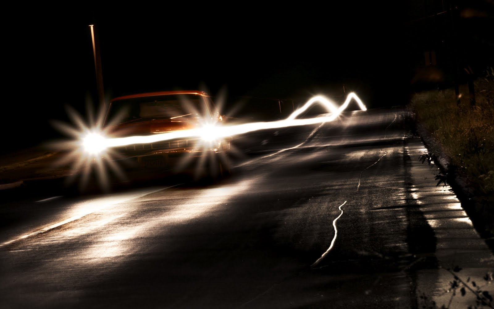

# ywan0479_YizeWang_9103_groupproject

## I. Instructions

After opening the page, a daytime city scene is displayed. The road colors smoothly transition (not very obvious, requiring careful observation), and cars automatically move along the roads. Click **'Toggle Night Mode'** to switch to a nighttime scene.

## II Individual details

I chose perlin noise.

**1. Road Block Colors**
The road blocks' colors are animated using Perlin noise, which means the colors will gradually change over time, creating a smooth transition effect. This is handled in the updateColor() method of the Block class, where the RGB values are mapped from the Perlin noise values.

**2. Car Movement**
The cars on the roads are animated to move automatically along the roads. This movement is achieved in the move() method of the Car class, where each car's position (x or y) is incremented based on its speed. The cars will either move horizontally or vertically, depending on the orientation of the road they are on.

**3. Car Trail Effect**
Each car has a trailing effect, which fades as the car moves. This effect is created by gradually reducing the trail's alpha value (trailAlpha) using linear interpolation (lerp). The trail creates a dynamic, fading effect that follows the car as it moves along the road.

**4.Night Mode Transition**
When the "Toggle Night Mode" button is clicked, the background, road blocks, and car colors change to represent a nighttime scene. This change is not animated per frame but is a state-based transition that occurs immediately when the button is clicked.

## II Inspiration
I mainly want to showcase the process of urban roads changing colors due to traffic flow variations, as well as the effect of car lights flickering. Additionally, I want to demonstrate the difference in city colors during day and night, so I implemented two modes. The reference images below show the changes in road colors, moving vehicles, and the flickering car lights.

## III Technical explanation

This code begins by representing city elements with the `Block` class, where each block has properties for position, size, color, and whether it is a road block. The `initializeBlocks()` function defines these initial road and building blocks, setting up the basic layout of the city with roads and structures.

The road colors are animated using Perlin noise to simulate subtle traffic flow variations. The `updateColor()` method in the `Block` class uses Perlin noise values to smoothly transition road colors over time, adding life to the city scene.

The `Car` class is used to create car objects that simulate movement along the roads. Cars move either horizontally or vertically, depending on the road orientation, and loop back when they reach the edge of a road. The `draw()` function updates the background, draws all the blocks, and moves the cars each frame. Each car's attributes—position, speed, and direction—are randomized, while a fading trail effect simulates flickering car lights, adding dynamic visual interest.

A button toggles between day and night modes. In day mode, the roads and cars are represented with brighter colors, while in night mode, the colors darken, and car lights become more prominent. This effect is implemented by modifying the `isNightMode` flag, which influences the background color and visual representation of the roads and cars.

Lastly, the `windowResized()` function ensures that the canvas is resized when the window size changes, and it resets the blocks and cars to maintain a consistent scene, avoiding excessive accumulation of elements.

